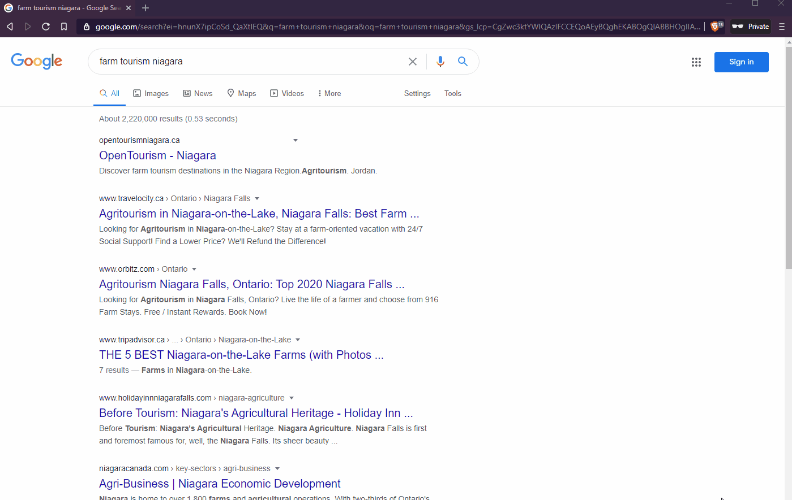

# AgritechHack 2020

## Category: Agritourism & Sustainability

### Problem we attempted to solve was with the ease of access to tourism location information for searchers interested in visiting the Niagara Region. Search results are not always fruitful and existing respources do not effectivly connect search terms and other agri tourism operations for searchers to find.

### Search results for apple picking lead to information overload and poor resources for planning a trip that involves more than one activity.

### With good SEO OpenTourism (open source web app) can become the top result.

### OpenTourism is a platform that aaggregates google business listings related to agri tourism in one location so tourists can find new activiies that interest them and learn about sustainable tourism practises while planning their trip. Ideally hosted and suppored by local government's economic development offices. Local tourism operations can also submit their google business listing to be added to the app, and updated to google listings will be reflected in the app.
